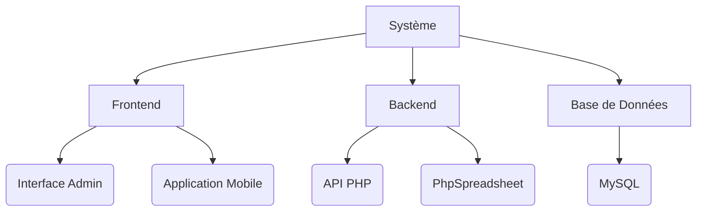
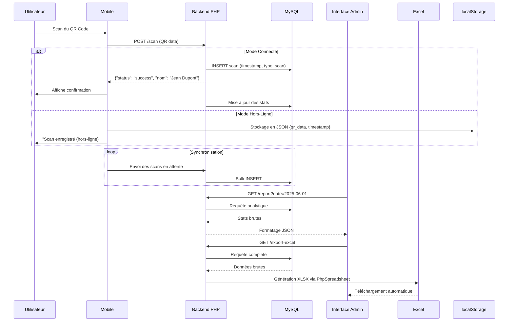
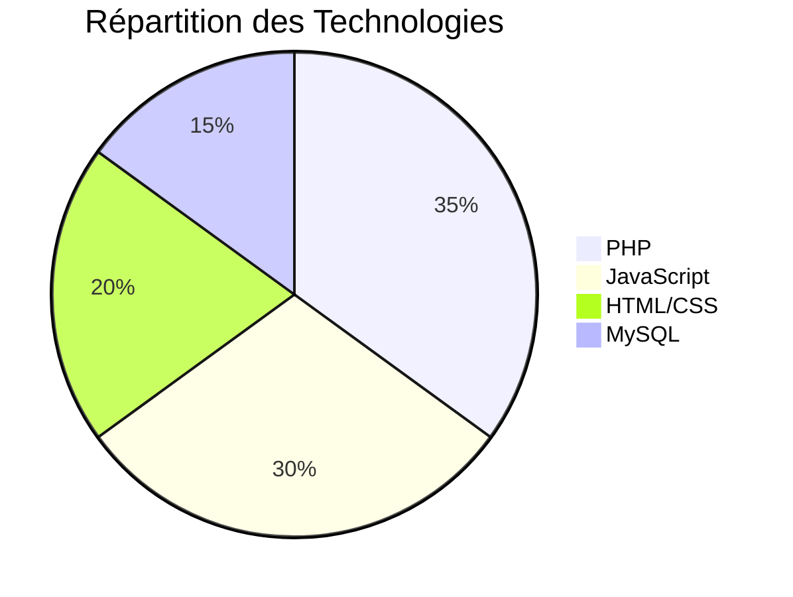

# 📊 Système d’assiduité intelligent via validation biométrique

*Un projet complet de gestion des entrées/sorties en milieu industriel avec analyse des données grâce à des outils opensource et entièrement développée en interne, sans recours à du matériel spécifique.*



## 🛠️ Stack Technologique

### **Core Stack**
| Catégorie        | Technologies                                                                 |
|------------------|-----------------------------------------------------------------------------|
| **Frontend**     | HTML5, CSS3, JavaScript Vanilla, Chart.js                                   |
| **Backend**      | PHP 8+, MySQL                                                               |
| **Bibliothèques**| Instascan.js (Lecture QR), PhpSpreadsheet (Export Excel)                    |
| **Outils**       | XAMPP, phpMyAdmin, VS Code, NGROK                                                  |

### **Fonctionnalités Clés**
- 🚪 Système de badge QR avec historique
- 📈 Tableau de bord analytique
- 📊 Génération de rapports Excel avancés
- 📱 Mode hors-ligne (localStorage)
- 🔐 Interface admin sécurisée

## 🌐 Architecture du Projet

```bash
badge-system/
├── admin/
│   ├── index.php          # Dashboard analytique
│   ├── functions.php      # Fonctions utilitaires
│   ├── style.css          # Styles CSS
│   └── script.js          # Logique frontend
├── mobile/
│   ├── index.html         # Interface de scan
│   └── script.js          # Gestion du QR et offline
├── api/
│   ├── get-report.php     # Endpoint des données
│   └── export-excel.php   # Génération Excel
└── vendor/                # Dependencies PHP
```

## 🔧 Installation Locale

### Prérequis
- PHP 8.0+
- MySQL 5.7+
- Ngrok
- Composer (pour PhpSpreadsheet)

```bash
# Cloner le dépôt
git clone https://github.com/votre-utilisateur/badge-system.git
cd badge-system

# Installer les dépendances
composer install

# Importer la base de données
mysql -u username -p badge_scan_db < database.sql
```

## 🚀 Fonctionnalités Avancées

### **1. Système de Scan Intelligent**


### **2. Analyse des Données**

## Côté Mobile

### Lecture QR
Utilisation d'Instascan.js avec optimisation pour mobiles low-end

### Gestion offline
```javascript
// Structure du localStorage
{
  "pending_scans": [
    {
      "qr_data": "JEAN123",
      "timestamp": "2025-06-05T08:30:00Z",
      "sync_attempts": 0
    }
  ]
}
```

### Synchronisation
Exponential backoff pour les réessais (1min, 5min, 15min)

## Côté Backend

### Endpoints API
```php
// scan.php
$data = json_decode(file_get_contents('php://input'));
$stmt = $conn->prepare("INSERT INTO scans (...) VALUES (?, ?, ?)");
$stmt->bind_param("iss", $data->ouvrier_id, $data->timestamp, $data->type);
```

## Côté Admin

### Analyse en temps réel
```sql
/* Requête pour détection des retards */
SELECT 
  COUNT(CASE WHEN TIME(arrival) > heure_debut THEN 1 END) as retards,
  COUNT(CASE WHEN arrival IS NULL THEN 1 END) as absents
FROM scans
WHERE DATE(timestamp) = CURDATE()
```

### PhpSpreadsheet
```php
// Formatage conditionnel Excel
$sheet->getStyle('D2:D100')
  ->getNumberFormat()
  ->setFormatCode(
    '[Vert]#,##0.00;[Rouge]-#,##0.00;[Jaune]"Retard"'
  );
```

## Workflow Complet Admin

### 1. Authentification
Session PHP avec token JWT côté client
```php
$_SESSION['admin'] = [
  'last_activity' => time(),
  'ip' => $_SERVER['REMOTE_ADDR']
];
```

### 2. Dashboard
Calcul des KPI en temps réel :
```sql
/* Taux de présence */
SELECT 
  (COUNT(DISTINCT CASE WHEN s.id IS NOT NULL THEN o.id END) / 
  COUNT(DISTINCT o.id)) * 100 as taux_presence
FROM ouvriers o
LEFT JOIN scans s ON o.id = s.ouvrier_id AND DATE(s.timestamp) = ?
```

### 3. Détection d'Anomalies
Algorithme de repérage des motifs récurrents :
```php
// Détection des retardataires fréquents
$frequent_lates = $conn->query("
  SELECT ouvrier_id, COUNT(*) as lates 
  FROM scans 
  WHERE TIME(timestamp) > heure_debut
  GROUP BY ouvrier_id 
  HAVING lates > 3
");
```

### 4. Export Avancé
Classe Excel dédiée avec :
- Onglets multiples
- Formules intégrées (SOMME.SI, MOYENNE)
- Mise en forme conditionnelle

## Optimisations Notables

### Indexation MySQL
```sql
CREATE INDEX idx_scans_composite ON scans(ouvrier_id, DATE(timestamp));
```

### Cache navigateur
```javascript
// Service Worker pour pré-cache des assets admin
workbox.routing.registerRoute(
  new RegExp('/admin/.*\\.(js|css)'),
  new workbox.strategies.CacheFirst()
);
```


- Calcul automatique des retards (seuil configurable)
- Détection des absences
- Statistiques journalières/mensuelles

### **3. Export Excel**
```php
// Exemple de code PhpSpreadsheet
$spreadsheet = new Spreadsheet();
$sheet = $spreadsheet->getActiveSheet();
$sheet->setCellValue('A1', 'Rapport des Présences');
$writer = new Xlsx($spreadsheet);
$writer->save('php://output');
```

## 📚 Bonnes Pratiques Implémentées

| Domaine          | Implémentation                                                                 |
|------------------|-------------------------------------------------------------------------------|
| **Sécurité**     | Protection admin par session PHP, Validation des entrées SQL                  |
| **Performance**  | Requêtes SQL optimisées, Cache localStorage                                   |
| **UX**           | Interface responsive, Feedback visuel immédiat                                |
| **Code Quality** | Separation of Concerns, Fonctions modulaires    

## 🧑‍💼 Cas d'utilisation

Ce système répond efficacement aux besoins des cas d'utilisation suivants. :

1. Gestion des présences en entreprise

2. Suivi des élèves / étudiants

3. Suivi des heures de travail

4. Traçabilité du personnel

5. Registre d’émargement numérique

6. Historique de présence

7. Tableau de bord RH

8. Journal des présences                             |

## 🤝 Contribution

Les contributions sont les bienvenues ! Voici comment participer :

1. Forkez le projet
2. Créez une branche (`git checkout -b feature/AmazingFeature`)
3. Committez vos changements (`git commit -m 'Add some AmazingFeature'`)
4. Pushez (`git push origin feature/AmazingFeature`)
5. Ouvrez une Pull Request

## 📜 License
MIT © [Votre Nom] - **Utilisation libre pour projets éducatifs et professionnels**

---



⭐ **Si ce projet vous a plu, n'hésitez pas à laisser une star sur GitHub !** ⭐

> *"Une solution complète pour la gestion moderne des présences en environnement industriel. Pas besoin de badgeuse, de lecteur RFID, ni de tablette dédiée : un simple navigateur web suffit. La solution a été pensée pour être autonome, portable et rentable dès le premier jour.*
